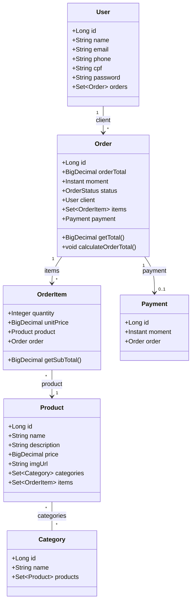

# Sistema de Gestão de Pedidos (E-commerce API)

> API RESTful profissional para orquestração de vendas e fluxo de entregas, focada em performance, segurança e integridade transacional.

<div align="center">
  
  
  
</div>

---

## 💻 Sobre o Projeto
  
O Sistema de Gestão de Pedidos é uma aplicação backend robusta desenvolvida com **Spring Boot**, projetada para simular o núcleo de um e-commerce escalável.

Este projeto vai além do CRUD básico. Ele implementa um modelo de domínio rico que orquestra o fluxo completo de uma venda: desde a catalogação de produtos e categorias, passando pela emissão de pedidos com itens variados, até o processamento do pagamento e mudança de status de entrega.

O diferencial técnico está na aplicação de **Boas Práticas de Engenharia de Software**, incluindo tratamento global de exceções, proteção contra vulnerabilidades de segurança (senhas criptografadas), validação estrita de dados e otimização de consultas ao banco de dados (resolução do problema N+1).

## 🚀 Funcionalidades e Regras de Negócio

| Funcionalidade | Status | Detalhes Técnicos e Regras de Negócio |
|:---|:---:|:---|
| **Gestão de Usuários** | ✅ | CRUD completo com **Criptografia de Senha** (BCrypt) e validação de duplicidade de e-mail/CPF. |
| **Catálogo de Produtos** | ✅ | Relacionamento **Muitos-para-Muitos** entre Produtos e Categorias. |
| **Orquestração de Pedidos** | ✅ | Criação de pedidos com itens complexos. O preço do item é "congelado" no momento da compra (Histórico de Preço). |
| **Otimização de Performance** | ✅ | Consultas **JPQL customizadas** com `JOIN FETCH` para evitar o problema de N+1 Selects em listagens grandes. |
| **Fluxo de Pagamento** | ✅ | Associação 1:1 estrita entre Pedido e Pagamento usando `@MapsId`. |
| **Validação de Dados** | ✅ | Uso de **Bean Validation** (`@NotNull`, `@Size`, `@Email`) para garantir a integridade da entrada antes do processamento. |
| **Tratamento de Erros** | ✅ | Respostas de erro padronizadas (JSON) via `ControllerAdvice`, convertendo exceções Java em status HTTP corretos (404, 422, 500). |

## 🛠 Arquitetura e Tecnologias

A aplicação segue o padrão de arquitetura em camadas (Layered Architecture), garantindo desacoplamento e testabilidade.

* **Linguagem:** Java 21
* **Framework:** Spring Boot 3
* **Dados:** Spring Data JPA (Hibernate)
* **Banco de Dados:** PostgreSQL (Produção) / H2 (Testes)
* **Segurança:** Spring Security (PasswordEncoder)
* **Utilitários:** Lombok, Java Records
* **Documentação:** OpenAPI (Swagger)

### Destaques de Código

* **DTO Pattern:** Separação estrita entre Entidades de Persistência e Objetos de Transferência de Dados, evitando exposição de dados sensíveis (ex: senha) no JSON de resposta.
* **Imutabilidade:** Uso de Java Records para respostas de erro e objetos de valor.
* **Clean Code:** Métodos coesos, variáveis descritivas e uso de `Pageable` para paginação de resultados.

## 📊 Diagrama de Domínio

A estrutura reflete um sistema de alta coesão:


## 📦 Estrutura de Pacotes
A organização é modular por domínio (modules), facilitando a manutenção:

```plaintext

com.juliana_barreto.ecommerce
├── modules
│   ├── user        # Controller, Service, Repository, DTO
│   ├── order       # Lógica de Pedidos e Pagamentos
│   ├── order_item  # Itens de pedido e Chaves Compostas
│   ├── product     # Produtos
│   └── category    # Categorias
├── shared
│   ├── exceptions  # Exceções Customizadas 
│   └── infra       # Configurações
└── EcommerceApplication.java
```

## ▶️ Como Executar
### Pré-requisitos
- Java 21
- Maven

### Passo a Passo
1. Clone o repositório:

```Bash
git clone [https://github.com/SEU-USUARIO/ecommerce-backend.git](https://github.com/SEU-USUARIO/spring-ecommerce.git)
cd spring-ecommerce
```

2. Configure as Variáveis de Ambiente:
Por segurança, a senha do banco de dados não está hardcoded. Defina a variável DB_PASSWORD no seu sistema ou IDE.

- Exemplo (Linux/Mac): `export DB_PASSWORD=sua_senha_local`
- Exemplo (Windows): `set DB_PASSWORD=sua_senha_local`

3. Execute a aplicação:

```Bash
./mvnw spring-boot:run
```

4. Acesse a Documentação (Swagger):
5. Abra o navegador em: `http://localhost:8080/swagger-ui.html`

<div align="center"> Desenvolvido com ☕ e Spring Boot por <strong>Juliana Barreto</strong>. </div>
