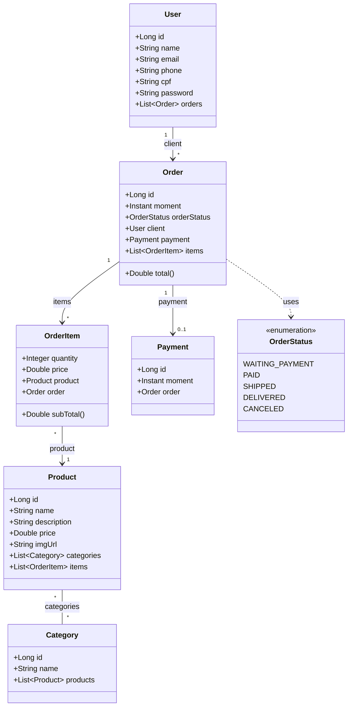

# Sistema de Gestão de Pedidos
>API RESTful para orquestração de vendas e fluxo de entregas, focado em regras de negócio complexas e integridade transacional.

<div align="center">
  
  
  
  
</div>

---

## Sobre o Projeto

O Sistema de Gestão de Pedidos é uma aplicação robusta desenvolvida em Java com o framework Spring Boot, focada na construção de serviços RESTful escaláveis para gestão de vendas em um e-commerce.

Este projeto transcende o CRUD básico. Ele implementa um modelo de domínio rico que orquestra o fluxo completo de uma venda: desde a catalogação de produtos e categorias, passando pela emissão de pedidos com itens variados, até o processamento do pagamento e mudança de status de entrega. O sistema prioriza a integridade dos dados, regras de negócio reais, relacionamentos complexos entre entidades e tratamento global de exceções. O objetivo é demonstrar domínio sobre a arquitetura em camadas e boas práticas de modelagem de dados no backend.

## Funcionalidades e Regras de Negócio

A API gerencia todo o ecossistema de pedidos e usuários, documentada via Swagger/OpenAPI.

| Funcionalidade | Status | Descrição |
| :--- | :---: | :--- |
| **Gestão de Usuários** | ✅ | Cadastro completo com validação de dados, garantindo integridade de CPF, Email, Telefone e Senha.|
| **Catálogo de Produtos** | ✅ | Gerenciamento de produtos e categorização, permitindo organização flexível do inventário.|
| **Ciclo de Pedidos** | ✅ | Criação de pedidos com itens associados e vínculo automático ao cliente. |
| **Fluxo de Pagamento** | ✅ | Associação 1:1 entre Pedido e Pagamento, registrando o momento exato da transação financeira. |
| **Cálculo Automático** | ✅ | O sistema calcula o subtotal (preço do produto x quantidade) e o total do pedido diretamente no domínio. |
| **Status de Pedido** | ✅ | Controle de fluxo via Enum (Aguardando Pagamento -> Entregue). |
| **Tratamento de Erros** | ✅ | Respostas de erro padronizadas (JSON) para 404, 400 e 500 via `ControllerAdvice`. |

## Arquitetura e Conceitos Técnicos

A aplicação segue o padrão de arquitetura em camadas, garantindo separação de responsabilidades e desacoplamento entre as regras de negócio e a camada de acesso a dados.

| Componente Backend | Regra de Negócio | Conceito Técnico Aplicado |
| :--- | :--- | :--- |
| **Entidades (Domain)** | Mapeamento das tabelas do banco e relacionamentos (1:N). | **JPA/Hibernate** (`@Entity`, `@OneToMany`) e **Lombok**. |
| **Service Layer** | Regras de negócio, como buscar usuário antes de criar pedido e calcular totais. | **Injeção de Dependência** e Transactional Management. |
| **Exception Handler** | Se um recurso não for encontrado ou dados forem inválidos, a API não "quebra", mas retorna JSON legível. | **Global Exception Handling** (`@RestControllerAdvice`) e **Java Records**. |
| **DTOs/Records** | Objetos imutáveis para transporte de dados, protegendo a entidade de domínio de exposição direta. | **Java 17+ Records** (Imutabilidade e concisão). |
|**Database Seeding** |	População inicial do banco de dados para testes de integração e validação do modelo. | CommandLineRunner e perfil de Teste. |
| **Documentação** | Exposição dos endpoints para consumo pelo Frontend ou Mobile. | **OpenAPI / Swagger UI**. |

## Diagrama de Classes e Relacionamentos

A estrutura do domínio reflete um sistema de alta coesão, com relacionamentos fortes entre Clientes, Pedidos, Itens de Pedido e o Catálogo de Produtos:


## Estrutura do ProjetoA organização de pacotes é modular, facilitando a escalabilidade do sistema:
```Plaintext
📦 com.juliana_barreto.ecommerce
 ┣ 📂 modules
 ┃ ┣ 📂 user            # Controller, Service, Repository e Entity de Usuário
 ┃ ┣ 📂 order           # Lógica de Pedidos, Pagamentos e Itens
 ┃ ┗ 📂 product         # Gestão de Produtos e Categorias
 ┣ 📂 shared
 ┃ ┣ 📂 config          # Configurações de segurança e seeding (TestConfig)
 ┃ ┣ 📂 exceptions      # Exceções personalizadas
 ┃ ┗ 📜 GlobalExceptionHandler.java
 ┗ 📜 EcommerceApplication.java
```
## Impacto Técnico e Métricas

| Indicador | Detalhe |
| :--- | :--- |
| **Endpoints** | ~15 Endpoints REST (CRUDs completos + Operações de Associação) |
| **Confiabilidade** | Tratamento centralizado de erros HTTP e validação de input |
| **Padrões de Projeto** | Singleton (Beans), Factory (implícito no Spring), Strategy (Auth) |
| **ORM** | Hibernate com Spring Data JPA |
| **Persistência** | Banco Relacional (Postgres) |

### Como Executar

1. Clone o repositório:
```bash
git clone [https://github.com/SEU-USUARIO/ecommerce-backend.git](https://github.com/SEU-USUARIO/ecommerce-backend.git)
```

2. Configure o banco de dados no arquivo src/main/resources/application.properties.

3. Execute o projeto via Maven:

```Bash
./mvnw spring-boot:run
```

4. Acesse a documentação da API (Swagger):

```Plaintext

http://localhost:8080/swagger-ui.html
```

<div align="center">Desenvolvido com ❤️ por Juliana Barreto.</div>
