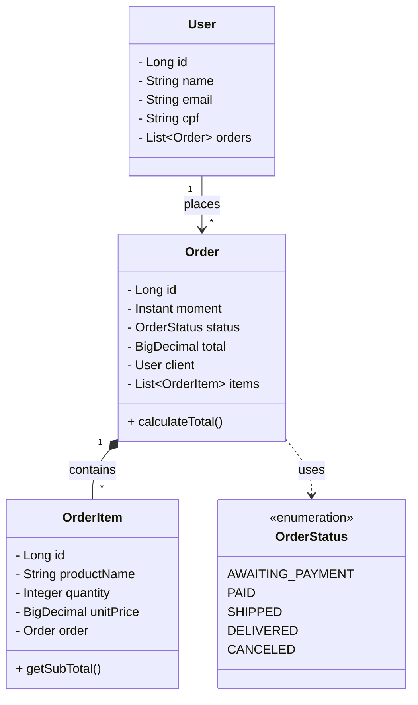

# E-commerce Backend API - API RESTful de Gestão de Pedidos 

<div align="center">
    
    
    
    
    
</div>

---

## Sobre o Projeto

O **E-commerce Backend API** é uma aplicação robusta desenvolvida em **Java** com o framework **Spring Boot**, focada na construção de serviços RESTful escaláveis para gestão de vendas.

Este projeto vai além do CRUD básico, implementando **regras de negócio reais** de um e-commerce, como cálculo automático de totais de pedidos, fluxo de status de entrega, relacionamentos complexos entre entidades e **tratamento global de exceções**. O objetivo é demonstrar domínio sobre a arquitetura em camadas e boas práticas de desenvolvimento backend.

## Funcionalidades e Regras de Negócio

A API gerencia todo o ecossistema de pedidos e usuários, documentada via Swagger/OpenAPI.

| Funcionalidade | Status | Descrição |
| :--- | :---: | :--- |
| **Gestão de Usuários** | ✅ | Cadastro completo com validação de dados (CPF/Email únicos). |
| **Ciclo de Pedidos** | ✅ | Criação de pedidos com itens associados e vínculo automático ao cliente. |
| **Cálculo Automático** | ✅ | O sistema calcula o subtotal (preço x qtd) e o total do pedido no backend. |
| **Status de Pedido** | ✅ | Controle de fluxo via Enum (Aguardando Pagamento -> Entregue). |
| **Tratamento de Erros** | ✅ | Respostas de erro padronizadas (JSON) para 404, 400 e 500 via `ControllerAdvice`. |

## Arquitetura e Conceitos Técnicos

A aplicação segue o padrão de arquitetura em camadas (Layered Architecture), garantindo separação de responsabilidades e desacoplamento.

| Componente Backend | Regra de Negócio | Conceito Técnico Aplicado |
| :--- | :--- | :--- |
| **Entidades (Domain)** | Mapeamento das tabelas do banco e relacionamentos (1:N). | **JPA/Hibernate** (`@Entity`, `@OneToMany`) e **Lombok**. |
| **Service Layer** | Regras de negócio, como buscar usuário antes de criar pedido e calcular totais. | **Injeção de Dependência** e Transactional Management. |
| **Exception Handler** | Se um recurso não for encontrado ou dados forem inválidos, a API não "quebra", mas retorna JSON legível. | **Global Exception Handling** (`@RestControllerAdvice`) e **Java Records**. |
| **DTOs/Records** | Objetos imutáveis para transporte de dados (ex: `ErrorResponse`). | **Java 17+ Records** (Imutabilidade e concisão). |
| **Documentação** | Exposição dos endpoints para consumo pelo Frontend ou Mobile. | **OpenAPI / Swagger UI**. |

## Diagrama de Classes e Relacionamentos

A estrutura do domínio reflete um relacionamento forte entre Clientes, Pedidos e Itens:


## Estrutura do ProjetoA organização de pacotes é modular, facilitando a escalabilidade do sistema:
```Plaintext
📦 com.juliana_barreto.ecommerce
 ┣ 📂 modules
 ┃ ┣ 📂 user            # Controller, Service, Repository e Entity de Usuário
 ┃ ┗ 📂 order           # Toda lógica relacionada a Pedidos e Itens
 ┣ 📂 shared
 ┃ ┣ 📂 exceptions      # Exceções personalizadas
 ┃ ┗ 📜 GlobalExceptionHandler.java  # Interceptador de erros globais
 ┗ 📜 EcommerceApplication.java
```
## Impacto Técnico e Métricas

| Indicador | Detalhe |
| :--- | :--- |
| **Endpoints** | ~9 Endpoints REST (GET, POST, PUT, DELETE) |
| **Confiabilidade** | Tratamento centralizado de erros HTTP |
| **Padrões de Projeto** | Singleton (Beans), Factory (implícito no Spring), Strategy (Auth) |
| **ORM** | Hibernate com Spring Data JPA |
| **Persistência** | Banco Relacional (Postgres) |

### Como Executar

1. Clone o repositório:
```bash
git clone [https://github.com/SEU-USUARIO/ecommerce-backend.git](https://github.com/SEU-USUARIO/ecommerce-backend.git)
```

2. Configure o banco de dados no arquivo src/main/resources/application.properties.

3. Execute o projeto via Maven:

```Bash
./mvnw spring-boot:run
```

4. Acesse a documentação da API (Swagger):

```Plaintext

http://localhost:8080/swagger-ui.html
```

<div align="center">Desenvolvido com ❤️ por Juliana Barreto.</div>
